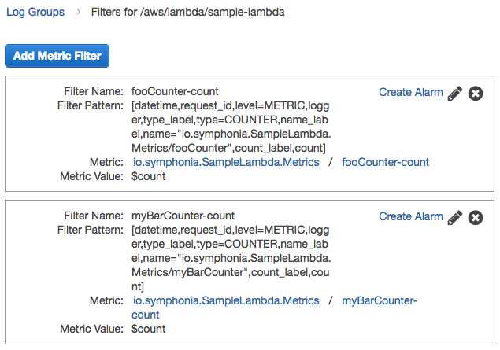
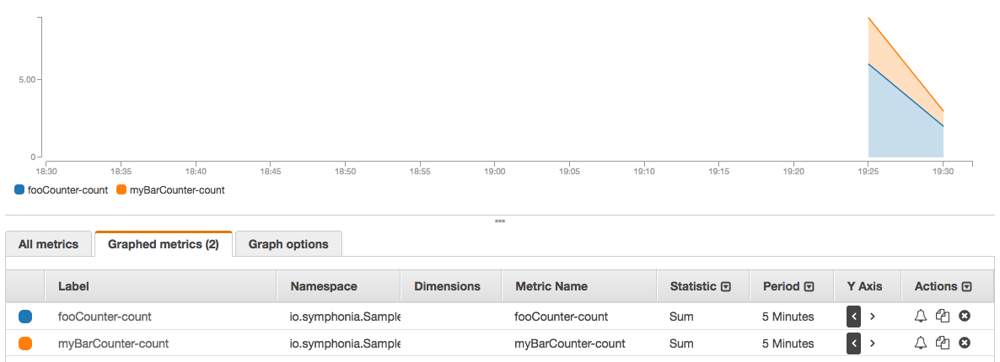

# lambda-metrics-maven-plugin

Annotation-driven, automated Cloudwatch Metric Filters publishing. Used alongside [`lambda-metrics`](https://github.com/symphoniacloud/lambda-monitoring/tree/master/lambda-metrics).

## Quick Start

1. **Using the [`lambda-metrics` library and documentation](https://github.com/symphoniacloud/lambda-monitoring/tree/master/lambda-metrics), add some annotated Codahale metrics to your source code.** 

1. **Add the `io.symphonia/lambda-metrics-maven-plugin` plugin to your Maven project**

   ```xml
   <build>
      <plugins>
         <plugin>
            <groupId>io.symphonia</groupId>
            <artifactId>lambda-metrics-maven-plugin</artifactId>
            <version>1.0.0</version>>
         </plugin>
      </plugins>
   </build>
   ```
   
1. **Execute the `publish` goal to publish Metric Filters**
   
   The default plugin execution isn't tied to a lifecycle phase, you must manually invoke it:
   
   ```shell
   $ mvn lambda-metrics:publish
   ```
   
   The output from that command (run against the sample project) looks like this:
   
   ```shell
   [INFO] Found [2] metric fields in classpath.
   [INFO] Publishing metric filter [myBarCounter-count] to log group [/aws/lambda/sample-lambda]
   [INFO] Publishing metric filter [fooCounter-count] to log group [/aws/lambda/sample-lambda]
   [INFO] Published [2] metric filters.
   ```
   
   You can see the Metric Filters in the Cloudwatch console:
   
   
   
   And, you can graph the Cloudwatch Metrics themselves:
   
   
   
## FAQ

#### 1. Can `lambda-metrics-maven-plugin` remove Cloudwatch Metric Filters?

Yes. The `remove` goal will remove any Cloudwatch Metric Filters that are associated with your annotated metrics.

## TODO

Add a `generate` goal, to produce Cloudformation files for publishing / removing Cloudwatch Metric Filters, without actually performing those operations. This would allow users to generate and version control the infrastructure changes that accompany their Lambda function code changes.
